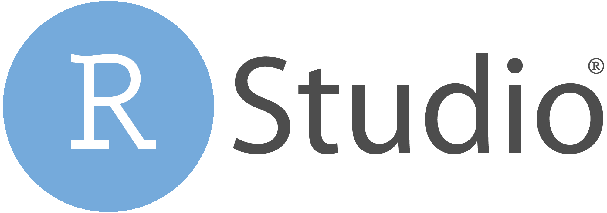

## About

This template expands on the minimal example, and includes a logo and custom CSS. 

## Creating Directory

If you look at the file `inst/rmarkdown/templates/02-extra-files/templates.yaml`, you will see that the following line:

```
create_dir: true
```

This means that a new directory will be created when the template is selected. This will copy over the content of the folder `inst/rmarkdown/templates/02-extra-files/skeleton`to the directory selected.

## Example features

The custom CSS has been used to change the style of the tables in the document.

```{r}
knitr::kable(mtcars[1:5, 1:5], caption = "A custom table style")
```

## Customisation

You may want to consider making the following changes

- altering the style.css file to change the style of the table
- Add your own logo to the header by replacing the `logo.png` file.

## Limitations

You may notice that this kind of template requires the external files to be in the same working directory as the R Markdown file. This can make the file less portable, and also can become frustrating if you want to have lots of additional files.

You may overcome this limitation by creating a custom R Markdown format. This allows us to reference to files contained directly within your custom template package. To see an example of this, check out template 5.

